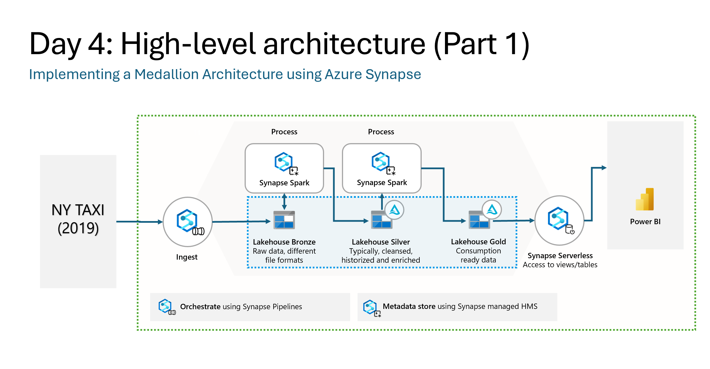
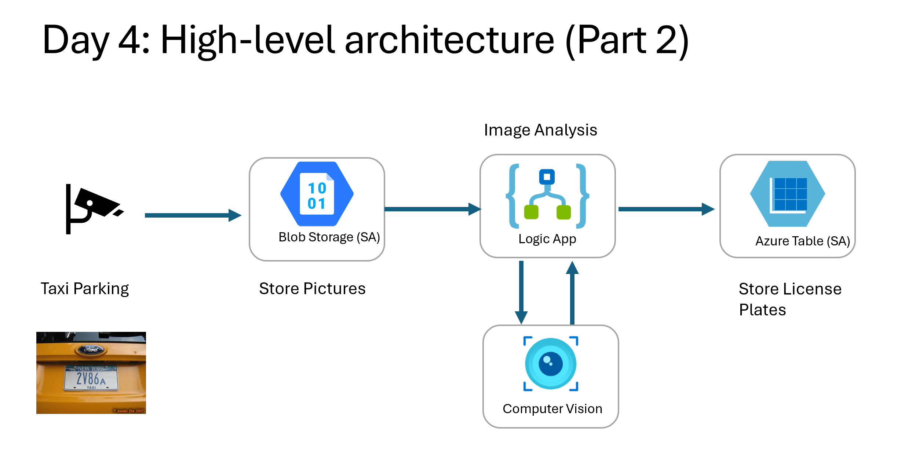

# Home work

Home work will consist of some open ended question you will need to answer and **upload to ADI before next Friday 3rd of October 2PM**.

Feel free to upload them as a word or pdf document.

**Question 1**

During the 4 Azure Days you have implemented the architecture used above with both Azure Databricks/Data Factory and Azure Synapse. Give 3 detailed reasons to go for one option or the others.

| Azure Databricks/Data Factory | Azure Synapse |
| -------- | -------- |
| Reason 1 | Reason 1 |
| Reason 2 | Reason 2 |
| Reason 3 | Reason 3 |

**Question 2** 

Why would I create and publish my reports in PowerBI, if I could also create similar charts/analysis using ,for example, Synapse Spark Notebooks?

**Question 3**
Based on the New York Taxy dataset, could you think about an scenario where the data given can be used to create your own model using Azure Machine Learning? Explain briefly the process you would follow.

**Question 4**

During day 4 you have implemented the architecture (Part2) shown above. What other alternative would you recommend to execute the Image Analysis? New York taxy company is looking for a solution that:
- Can be implemented using Python
- Can be triggered automatically
- Is only paid when executing
Give a detailed explanation for your chosen service.

**Question 5**
Lets imagine New York Taxi company uses an app were customers can give reviews. Based on the content seen on day 2, give an example architecture(and services) the taxi company could use that:
- Stores every review
- Analyzes the sentiment of those reviews
- Sends an email when the review sentiment is related to anger/dissapointment.
Justify every service choice.
