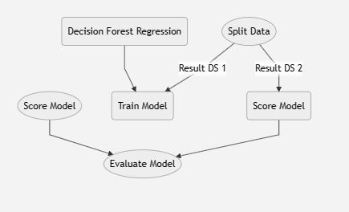

# Day 2 - Cloud Computing (Azure) - Data Science

> Class by Ane Iturzaeta (aniturza@microsoft.com)

> 20/10/2023 Tecnun

## Part 1: Azure AI - Azure Cognitive Services

* Vision Services - Studio [Vision Studio](https://portal.vision.cognitive.azure.com/gallery/featured)
* Speech Services - Studio [Speech Studio](https://speech.microsoft.com/portal)
* Language Services - Studio [Language Studio](https://language.cognitive.azure.com/)
* Document Intelligence - Studio [Form Recognizer Studio](https://formrecognizer.appliedai.azure.com/studio)
* Call from Postman
* Develop a Logic App in Azure (opt)

**Exercise 1**: 

1. create cognitive services resource in Azure
2. use the preferred studio and try some APIs - *show an example and share screenshot*

> links to Studios above. Make sure you have created the source previously in Azure

3. learn how to use cognitive services from Postman - *show finalization and share screenshot*

	* Link to postman: [Sign up](https://www.postman.com/)
	* Link to reference API: 
		* [Vision - image analysis](https://learn.microsoft.com/en-us/rest/api/computervision/2023-02-01-preview/image-analysis/analyze?tabs=HTTP)
		* [NLP - text analysis](https://learn.microsoft.com/en-us/rest/api/language/2023-04-15-preview/text-analysis-runtime/analyze-text?tabs=HTTP)
		* [Form Recognizer - layout or invoice](https://westeurope.dev.cognitive.microsoft.com/docs/services/form-recognizer-api-2023-02-28-preview/operations/AnalyzeDocument/console)

## Part 2: Azure AI - Azure Machine Learning Service

**Exercise 2**:

* Designer - *show finalization and share screenshot*
 - [ ] Go to Designer in AML Studio 
 - [ ] From the examples, select the "Regression - Automobile Proce Prediction (Basic)". The canvas will open with different nodes already there. 
 - [ ] Submit the experiment and see what is happening at the output of each step
 - [ ] Now we will train a new model and compare results in the "Evaluate Results" node. Follow this diagram to understand which blocks you must add to the current flow. Do not delete anything, just add the new blocks.  

*Important: the circles are the current blocks from the example and the squared nodes are the ones you must insert into the template*

Here is a simple flow chart:

**Exercise 3**:

* AutoML - *show finalization and share screenshot*
[Exercise 3 - AutoML](https://learn.microsoft.com/en-us/azure/machine-learning/tutorial-first-experiment-automated-ml?view=azureml-api-2) 

**Exercise 4**:

* Notebooks - *show finalization and share screenshot*
[Exercise 4 - Notebooks](https://github.com/murggu/tecnun-cc-23/day2/Exercise4-notebooks) - download the folder and upload it to Azure ML Notebooks

## Part 3: Azure AI - Generative AI

Only theoretical part, will be asked in the evaluation part

## Part 4: Use cases examples

Only theoretical part, will be asked in the evaluation part

## Part 5: Evaluation test

