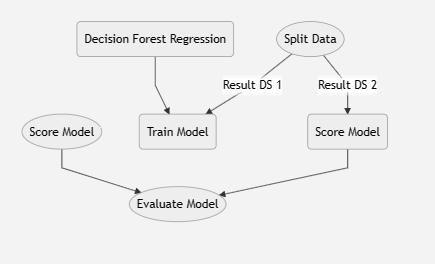

# Day 2 - Cloud Computing (Azure) - Data Science

> Class by Ane Iturzaeta (aniturza@microsoft.com)

> 20/10/2023 Tecnun

## Part 1: Azure AI - Azure Cognitive Services

* Vision Services - Studio [Vision Studio](https://portal.vision.cognitive.azure.com/gallery/featured)
* Speech Services - Studio [Speech Studio](https://speech.microsoft.com/portal)
* Language Services - Studio [Language Studio](https://language.cognitive.azure.com/)
* Document Intelligence - Studio [Form Recognizer Studio](https://formrecognizer.appliedai.azure.com/studio)
* Call APIs from Postman

**Exercise 0**: Preparation

1.  Go to Azure Portal and login with your account: [Azure Portal](https://portal.azure.com/)

2. Create a **Cognitive Service** resource in Azure: create a cognitive service resource + new resource group
	- Region: North Europe
	- Name: cogser-<6_letters_alias_alumno>-d2
	- Tag: owner = "alias estudiante"

2. Create an **Azure Machine Learning** resource in Azure: within the same resource group you just created
	-  Region: North Europe
	- Name: aml-<6_letters_alias_alumno>-d2
	- Create also a Container Registry with name: "containeryournamed2" - remember you cannot add spaces or other characters
	- Tag: owner = "alias estudiante"

**Exercise 1**: 

1. create cognitive services resource in Azure
2. use the the 4 studios and try at least 1 API in each of them - [S]

	> links to Studios above. Make sure you have created the Cognitive Service resource previously in Azure

Optional:

3. learn how to use cognitive services from Postman 

	* Link to postman: [Sign up or in](https://www.postman.com/)
	* Link to reference API: 
		* [Vision - image analysis](https://learn.microsoft.com/en-us/rest/api/computervision/2023-02-01-preview/image-analysis/analyze?tabs=HTTP)
		* [NLP - text analysis](https://learn.microsoft.com/en-us/rest/api/language/2023-04-15-preview/text-analysis-runtime/analyze-text?tabs=HTTP)
		* [Form Recognizer - layout](https://learn.microsoft.com/en-us/azure/ai-services/document-intelligence/quickstarts/get-started-sdks-rest-api?view=doc-intel-3.1.0&pivots=programming-language-rest-apie)

## Part 2: Azure AI - Azure Machine Learning Service

**Exercise 2**:

* Go to the AML Studio to start working: [ml.azure.com](https://ml.azure.com/) - select the workspace you have just created in Exercise 0

* Go to Compute section and create a **Compute Instance** - create a new one
	- Name: "your alias"
	- Type: CPU --> See all --> "Standard_D2_v3"
	- Shutdown at 60 minutes (default)
	- CREATE and wait

* Train a model in *Designer* - [S]
 - [ ] Go to Designer in AML Studio 
 - [ ] From the examples, select the "Regression - Automobile Proce Prediction (Basic)". The canvas will open with different nodes already there. 
 - [ ] Submit the experiment and see what is happening at the output of each step

	Optional: compare two models

		- [ ] Now we will train a new model and compare results in the "Evaluate Results" node. Follow this diagram to understand which blocks you must add to the current flow. Do not delete anything, just add the new blocks.  

		*Important: the circles are the current blocks from the example and the squared nodes are the ones you must insert into the template*

		Here is a simple flow chart:

		

**Exercise 3**:

* AutoML - [S]
[Exercise 3 - AutoML](https://learn.microsoft.com/en-us/azure/machine-learning/tutorial-first-experiment-automated-ml?view=azureml-api-2) 

**Exercise 4**:

* Notebooks - [S]
[Exercise 4 - Notebooks](https://github.com/murggu/tecnun-cc-23/day2/Exercise4-notebooks) 

- download the folder and upload it to Azure ML Notebooks
- execute the cells one by one
- share hte screenshot of some cells executed

## Part 3: Azure AI - Generative AI

Only theoretical part, will be asked in the evaluation part

## Part 4: Use cases examples

Only theoretical part, discussion in the class

## Part 5: Evaluation test

* Complete the test in ADI (12 questions)

* Upload screenshots to ADI Task: marked by [S]

	From exercise 1: 

	- [ ] Selected Studio (Vision, Speech, Language or Form Recognizer) example

	From exercise 2:

	- [ ] Designer canvas final result

	From exercise 3:

	- [ ] AutoML results

	From exercise 4:

	- [ ] Execution of Notebook
