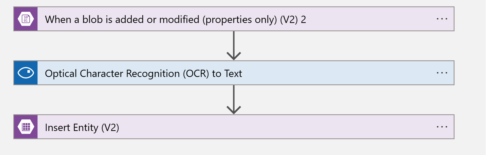

# Challenges

## Challenge 0 (all together)

Together we will define the high level architecture you are going to be implementing during the challenges.


## Part 1

Part 1 will be focused on implementing the following data solution for New York Taxi company.


### Challenge 1 (all together)

Lets create the neccesary resources for the Part 1 architecture. Follow the steps shown by the trainer to create:

- Azure Synapse workspace (keep same regions and RGs used in day 3) , example **synw-alias-d4**
    - Create Sypnpse spark pool
- Create a new ADLS Gen 2 for day 4 , example **dlsaliasd4**
    - File system name **nytaxi**
    - Create 3 folder/containers : bronze,silver and gold

### Challenge 2

 You will need to define the **Ingest** part of the solution using Synapse Pipelines.

 DATA: https://learn.microsoft.com/en-us/azure/open-datasets/dataset-taxi-yellow?tabs=azureml-opendatasets

 Start by adding the **NYC Taxi Yellow** dataset to your workspace, you can add it from the **Home Page > Knowledge Center > Browse Gallery**

 

 Then use Synapse pipeline to import **only 2019** data to the  **bronze**. The Dataset is structured as:
 - nyctlc
    - puYear=*
        - puMonth=*
            - Parquet files

**Tips**
 - Day 3 Data Factory solution as reference
 - Data Path
    

**Expected result**

You should be able to import 2019 data to your bronze folder in ADLS. **Take an screenshot of the folder with the imported data (from the Storage Account UI) to upload to ADI**

### Challenge 3 

You are going to use Azure Synapse Spark Notebooks to create the **silver** version of your data. The notebook will clean data, enrich it and save it in Delta format.


**Tips**
- Use notebooks from day 3 as reference
- Partial notebook **silver-prep.ipynb** is given
- Synapse Spark Notebooks https://learn.microsoft.com/en-us/azure/synapse-analytics/spark/apache-spark-development-using-notebooks
- ABFSS address https://learn.microsoft.com/en-us/azure/storage/blobs/data-lake-storage-introduction-abfs-uri#uri-syntax

**Expected result**

Execute the last line of the **silver-prep.ipynb** correctly. **Save the modified notebook file and upload it to ADI**.

```
#Expected Result
spark.sql("SELECT totalAmount, tripDistance, pricePerMile, tipPercentage  FROM silver_" + table_name).show(5)
```
### Challenge 4

You are going to use Azure Synapse Spark Notebooks to create the **gold** version of your data. The notebook will aggregate information and create some new tables.

**Tips**
- Use notebooks from day 3 as reference
- Partial notebook **gold-prep.ipynb** is given
- Synapse Spark Notebooks https://learn.microsoft.com/en-us/azure/synapse-analytics/spark/apache-spark-development-using-notebooks
- ABFSS address https://learn.microsoft.com/en-us/azure/storage/blobs/data-lake-storage-introduction-abfs-uri#uri-syntax

**Expected Result**
Show the solution to the teacher and save the modified **gold-prep.ipynb** notebook. **Upload it to ADI**

### Challenge 5 (will be done together in the end of the class)
challenge 5 shows how to connect the Synapse tables to PowerBI. Feel free to try it if finished earlier.

## Part 2

Part 1 will be focused on implementing the following data solution for New York Taxi company.


New York taxy company is looking for a way to track the Taxis that are leaving the parking when starting their services. You will help them implement the above solution.

### Challenge 6 (all together)

We will create the necessary resources for the given architecture:
- Azure Storage account
    - Public Blob container (pictures) - **license-pictures**
    - Azure table (extracted license plates) - **licenseplates**
- Azure Computer Vision
- Azure Logic App

### Challenge 7 

You will need to design the Logic App that takes the uploaded pictures, analyzes the image using Computer Vision and stores the data in an Azure Table.

**Tips**
- Both Blob storage and Azure table access can be authenticated using Access Key
- Trigger should be evaluated every 10 seconds and only take 1 file
- Logic App structure 
    
  

{
  "Image": "@{triggerBody()?['Name']}",
  "LicensePlate": "@{body('Optical_Character_Recognition_(OCR)_to_Text')?['text']}",
  "PartitionKey": "@{triggerBody()?['Id']}",
  "RowKey": "@{triggerBody()?['Id']}"

}


**Expected Result**
Upload the picture **Pictures/taxi1.jpeg** to the storage blob container, and the Logic app should execute succesfully, identifying the license plate and storing it as an entity in Azure Table. **Take an screenshot of the entity on Azure table (you can use the "Storage Browser" in the storage account UI)**.


 
